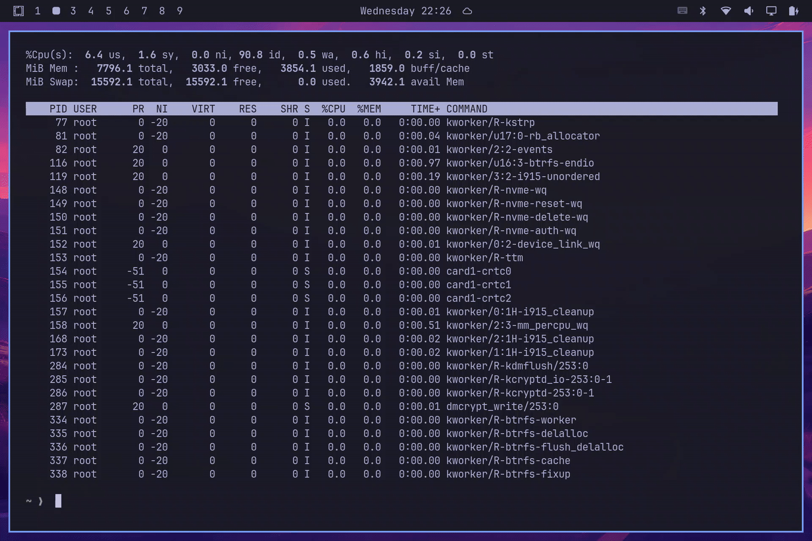

# Touch Gestures

[](https://github.com/rainan16/omarchy-workspace-touch-switch/actions/workflows/ci.yml)

An [Omarchy](https://omarchy.org) plugin that switches Hyprland workspaces with touch swipes, and can show live previews of the workspace you land on.

Development status: Tested only on a Microsoft Surface Go 2 (SKU 1926, ELAN9038). Reports from other digitizers welcome.




## What it does

- one finger, left edge, swipe right → previous workspace
- one finger, right edge, swipe left → next workspace
- two fingers, horizontal swipe anywhere → same mapping (`"twoFinger": true` only)
- brief OSD with the workspace name (optional live preview overlay)

Default one-finger edge swipes use layer-shell strips and do not need the `input` group. Two-finger anywhere is off until you set `"twoFinger": true`. Vertical two-finger moves are ignored.

Do not run a manual `./touch-gesture-daemon` while the plugin is in two-finger mode; both see the same events.

## Install

```sh
omarchy plugin add https://github.com/rainan16/omarchy-workspace-touch-switch.git --enable
```

Then `make` in the plugin directory (the daemon binary is not shipped) and restart the shell. Needs `gcc` and `make`. The `input` group is required only when `"twoFinger": true` (`groups` should list `input`; log out and back in after adding it).

The daemon reads `/dev/input/event*` but does not grab the device. Hyprland still receives the touch. Edge strips consume the outer ~4% of screen width; apps do not see those touches. The daemon path does not steal them.

## Settings

Configure on the plugin entry in `~/.config/omarchy/shell.json` (hot-reloads on save):

```json
{ "id": "rainan16.workspace-touch-switch", "twoFinger": true }
```

| Setting | Default | |
| --- | --- | --- |
| Two-finger swipes | off | Off keeps one-finger edge strips only, with no `input` group and no daemon. `"twoFinger": true` starts the daemon, hides the strips, and enables two-finger swipes anywhere plus one-finger edges. Needs `input`, then re-login. |
| Live preview overlay | off | `"overlay": true` shows live workspace previews and skips OSD. Preview windows use layout size (`width/scale`) so they fill the card on scaled displays. |
| OSD | on | The small `󰝁 workspace N` toast after a swipe. `"osd": false` hides it when the overlay is also off. Overlay on always skips OSD. |

If `"twoFinger": true` without `input`, the daemon logs `cannot open` and does not restart-storm. A toast says `Touch error: twoFinger mode without 'input' group`. Journal tells you to disable twoFinger, or add the input group and re-login. Edge strips are hidden too, so there are no gestures until you turn two-finger off.

Optional environment variables for the daemon (used only when `"twoFinger": true`):

| Setting | Default | |
| --- | --- | --- |
| `TOUCHSCREEN_DEVICE` | auto-detect | `/dev/input/event*` path. Auto-detect prefers digitizer names (`ntrg`, `n-trig`, `elan`, `atml`, `goodix`, `wacom`, `surface`) with `INPUT_PROP_DIRECT`, so a Surface keyboard touchpad is not chosen over ELAN/N-trig. Otherwise the first multi-touch device with `INPUT_PROP_DIRECT`. |
| `EDGE_RATIO` | `0.04` | Fraction of abs X range treated as an edge. |
| `SWIPE_RATIO` | `0.08` | Minimum swipe distance as a fraction of abs X range. |

## Test the daemon

```sh
make
./touch-gesture-daemon
```

Swipe. Expect one JSON line, then flush:

```json
{"gesture":"swipe-right","direction":"next"}
```

If it prints `cannot open` or `no touchscreen device found`, check the `input` group (`groups`) and re-login. This machine’s panel is typically `ELAN9038` at `/dev/input/event13`. The plugin only starts this daemon when `"twoFinger": true`.

Logs:

```sh
journalctl -t touch-gesture-daemon -f
journalctl --user -f | grep touch-gestures
```

## Remove

```sh
omarchy plugin remove rainan16.workspace-touch-switch
```

That deletes the plugin. Any `"id": "rainan16.workspace-touch-switch"` entry in `~/.config/omarchy/shell.json` is yours to remove.

## Development

Push and pull request to `main` run GitHub Actions: `make` with gcc and clang, `node --test` (pass count on the run summary), and `qmllint` against Omarchy's `quattro` shell (`qs.Commons` / `qs.Ui`). `omarchy plugin validate` still needs a local Omarchy install.

PRs dry-run [semantic-release](https://github.com/semantic-release/semantic-release) (`--dry-run`, read-only). After CI passes on `main`, it tags `vX.Y.Z`, writes a GitHub Release, and bumps `manifest.json` (plugin version). Use Conventional Commits (`feat:`, `fix:`, `BREAKING CHANGE`); `chore:` does not bump.

Tests, daemon replace (`ETXTBSY`), QML cache, and other gotchas are in [AGENTS.md](AGENTS.md).

## License

MIT
